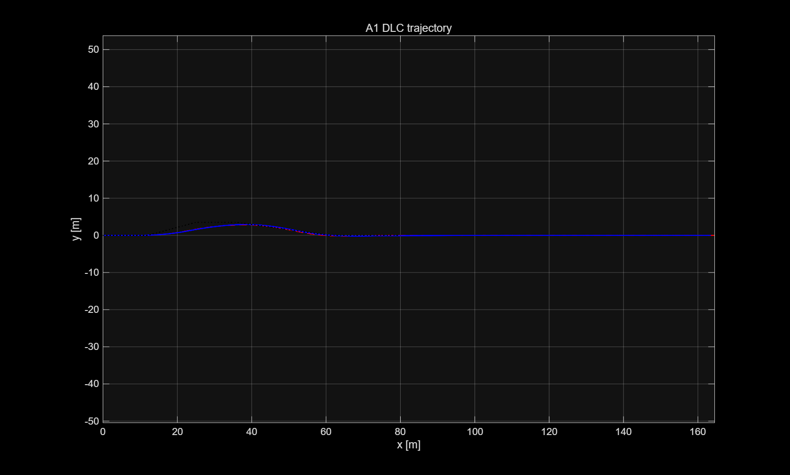
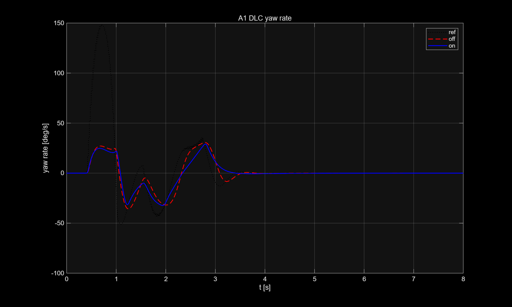
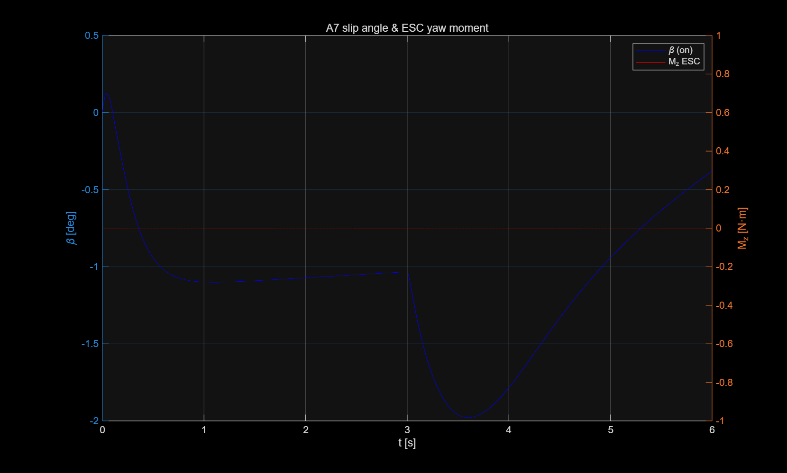
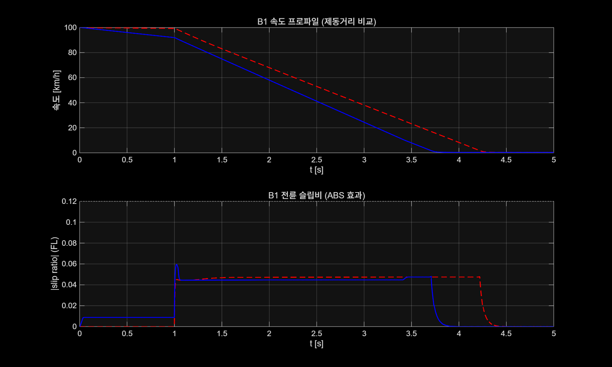

# [학번-이름] ICC 제어기 설계 보고서

**과목**: 자동제어 — 2026 봄
**제출일**: 2026-06-23
**팀**: 개인(202220814 박민재)
---

# 1. 설계 개요

본 프로젝트의 목표는 BMW 5시리즈 기반 14자유도 차량 동역학 모델에서
횡방향, 종방향, 수직방향 제어기를 통합적으로 설계하는 것이다.

평가 시나리오는 step steer, double lane change, understeer gradient,
sine with dwell, braking, disturbance rejection 등으로 구성되어 있다.
따라서 단일 성능만 높이는 것보다 여러 KPI 사이의 절충점을 찾는 것이
중요하였다.

예를 들어 제동력을 크게 하면 stopping distance는 줄어들지만
wheel slip이 증가할 수 있다. 또한 AFS 조향 개입을 강하게 하면
yaw rate 응답은 빨라질 수 있지만 LTR 또는 side slip이 악화될 수 있다.
따라서 본 설계에서는 각 제어기를 독립적으로 강하게 만드는 것보다,
시나리오 간 간섭을 줄이고 전체 성능을 안정적으로 유지하는 방향을
우선하였다.

제어기 설계에는 PID 제어, 속도 기반 gain scheduling, threshold 기반
안전 제어, skyhook damping, rule-based actuator allocation을 사용하였다.
횡방향 제어는 선형 bicycle model에서 yaw rate와 side slip angle이
차량 안정성을 대표한다는 점에 기반하여 설계하였다.

Yaw rate tracking은 PID 기반 active front steering으로 수행하였다.
Side slip angle이 임계값 이상으로 커지는 경우에는 counter-steer와
ESC yaw moment를 추가하였다.

PID 제어를 선택한 이유는 본 과제의 제어 인터페이스가 전체 상태 피드백보다
yaw rate, slip angle, velocity와 같은 제한된 측정값 중심으로 구성되어
있기 때문이다. LQR이나 MPC처럼 전체 상태공간 모델을 직접 사용하는 방법도
가능하지만, 고차 14-DOF plant와 비선형 tire dynamics를 모두 정확히
모델링하기는 어렵다.

또한 제한된 시간 안에서 여러 시나리오를 반복 튜닝해야 했기 때문에,
출력 피드백 기반의 PID 구조가 더 적합하다고 판단하였다. PID는
proportional, integral, derivative gain의 역할이 명확하여 overshoot,
rise time, settling time과 같은 KPI를 보며 조정하기 쉽다는 장점이 있다.

종방향 제어는 B1 braking scenario에 초점을 맞추어 설계하였다.
단순한 속도 추종 제어기가 아니라, 실제 제동 상황을 감속도와 wheel slip으로
감지한 뒤 추가 제동력을 제한적으로 생성한다. 이후 slip이 커지면
ABS 방식으로 제동을 완화하는 구조를 사용하였다.

수직방향 제어는 semi-active suspension에서 널리 사용되는 skyhook 제어
개념을 사용하였다. Coordinator는 각 제어기에서 나온 steer angle,
longitudinal force, yaw moment, damping coefficient를 실제 actuator
command로 변환한다. 특히 ESC yaw moment는 좌우 차동 제동으로 변환하고,
longitudinal braking은 직선 제동 조건에서만 반영하도록 하였다.

각 제어기의 역할은 다음과 같이 요약할 수 있다.

* `ctrl_lateral`:
  속도 스케줄링이 적용된 PID 기반 AFS로 yaw rate를 추종하고,
  slip angle 기반 counter-steer 및 ESC yaw moment로 beta-limiter 역할을
  수행한다.

* `ctrl_longitudinal`:
  제동 상황을 감지하여 추가 종방향 제동력을 생성하고, wheel slip 기반
  ABS scale 및 wheel별 brake reduction으로 과도한 slip을 완화한다.

* `ctrl_vertical`:
  On-off skyhook damping을 기본으로 하며, 좌우 suspension velocity 차이로
  roll motion을 감지하면 damping을 강화하는 CDC 구조를 사용한다.

* `ctrl_coordinator`:
  AFS 조향각을 제한하여 전달하고, yaw moment는 좌우 차동 brake torque로
  분배한다. 종방향 제동력은 직선 조건에서 전후 60:40으로 분배하며,
  ABS release correction을 brake torque에 반영한다.

최종 결과에서 A3 yaw rate response는 overshoot 2.0334,
rise time 0.1760 s, settling time 0.7270 s로 모두 target을 만족하였다.
A4와 A7도 모든 KPI를 만족하였으며, B1에서는 stopping distance를
61.4734 m까지 줄였다.

반면 A1과 D1에서는 lateral deviation 및 LTR에서 일부 한계가 남았다.
이는 제어기 성능 부족이라기보다, double lane change 상황에서 경로 추종,
side slip 억제, 횡하중 이동 억제 사이의 trade-off가 강하게 나타난
결과로 해석하였다.

# 2. 수학적 모델링

## 2.1 제어 설계용 Plant 단순화

제공된 검증 환경은 14-DOF 차량 모델을 사용하지만, 제어기 설계의 기준
모델로는 더 단순한 모델을 사용하였다. 14-DOF 모델은 4개 휠의 회전,
suspension, roll, pitch, tire nonlinear dynamics 등을 포함한다.

따라서 실제 차량 거동을 평가하기에는 적합하지만, 처음부터 이 모델 전체를
대상으로 제어기를 설계하면 상태 수가 많고 물리적 해석이 어려워진다.
이에 따라 횡방향 제어 설계에는 선형 2-DOF bicycle model을 사용하였다.

Bicycle model은 좌우 바퀴를 등가적인 전륜과 후륜으로 묶고, 차량의
횡속도 `v_y`와 yaw rate `r`만을 주요 상태로 둔다. 이 모델은 roll dynamics나
개별 휠 하중 이동을 직접 표현하지는 못하지만, yaw rate tracking과
side slip angle 제한을 설계하는 데 필요한 핵심 관계를 간결하게 제공한다.

본 제어기에서 가장 중요한 횡방향 출력은 yaw rate와 side slip angle이므로,
bicycle model은 AFS와 ESC 설계의 기준 모델로 적합하다고 판단하였다.

종방향 제어는 point-mass braking model로 단순화하였다. 차량 질량을 `m`,
종방향 속도를 `V_x`, 총 종방향 힘을 `F_x`라고 하면 기본 관계는 다음과 같다.

$$
m \dot{V}_x = F_x
$$

본 설계에서는 구동력 제어를 적극적으로 사용하지 않고, B1과 같은 제동
상황에서만 추가 제동력을 생성하였다. wheel slip은 시뮬레이터가 제공하는
값을 우선 사용하고, 값이 없는 경우에는 감속도 `a_x`를 이용해 간접적으로
추정하도록 하였다.

수직방향 제어는 각 휠 위치의 sprung mass velocity와 unsprung mass velocity를
사용하는 quarter-car 형태로 접근하였다. 각 휠에서 상대속도는 다음과 같이
정의하였다.

$$
v_{rel,i} =
\dot{z}*{s,i} - \dot{z}*{u,i}
$$

여기서 `dot(z_s,i)`는 i번째 휠 위치의 sprung mass vertical velocity이고,
`dot(z_u,i)`는 unsprung mass vertical velocity이다. Skyhook 제어는 이
상대속도와 차체 속도의 부호 관계를 이용하여 damping coefficient를 조절한다.

## 2.2 State-space 표현

횡방향 제어 설계에 사용한 선형 bicycle model의 상태변수는 다음과 같이
정의하였다.

$$
x =
\begin{bmatrix}
v_y \
r
\end{bmatrix},
\quad
u = \delta
$$

여기서 `v_y`는 차량 무게중심의 횡속도, `r`은 yaw rate,
`\delta`는 전륜 조향각이다. 출력은 yaw rate와 side slip angle을 함께
고려하였다.

$$
y =
\begin{bmatrix}
\beta \
r
\end{bmatrix}
$$

소각도 조건에서 side slip angle은 다음과 같이 근사할 수 있다.

$$
\beta \approx \frac{v_y}{V_x}
$$

선형 bicycle model의 상태방정식은 다음과 같다.

$$
\dot{x} = Ax + Bu
$$

$$
\dot{v}_y =
-\frac{C_f + C_r}{mV_x}v_y
+
\left(
\frac{l_rC_r-l_fC_f}{mV_x} - V_x
\right)r
+
\frac{C_f}{m}\delta
$$

$$
\dot{r} =
\frac{l_rC_r-l_fC_f}{I_zV_x}v_y

\frac{l_f^2C_f+l_r^2C_r}{I_zV_x}r
+
\frac{l_fC_f}{I_z}\delta
$$

따라서 `A`, `B` 행렬은 다음과 같이 정리된다.

$$
A =
\begin{bmatrix}
-\frac{C_f+C_r}{mV_x}
&
\frac{l_rC_r-l_fC_f}{mV_x}-V_x
\
\frac{l_rC_r-l_fC_f}{I_zV_x}
&
-\frac{l_f^2C_f+l_r^2C_r}{I_zV_x}
\end{bmatrix}
$$

$$
B =
\begin{bmatrix}
\frac{C_f}{m}
\
\frac{l_fC_f}{I_z}
\end{bmatrix}
$$

출력으로 side slip angle과 yaw rate를 함께 사용하면 다음과 같이 표현할 수 있다.

$$
C =
\begin{bmatrix}
\frac{1}{V_x} & 0 \
0 & 1
\end{bmatrix},
\quad
D =
\begin{bmatrix}
0 \
0
\end{bmatrix}
$$

여기서 `m`은 차량 질량, `I_z`는 yaw moment of inertia, `l_f`, `l_r`은
무게중심에서 전륜 및 후륜 축까지의 거리이다. `C_f`, `C_r`은 전륜 및
후륜 cornering stiffness이고, `V_x`는 종방향 속도이다.

Yaw rate reference는 정상상태 bicycle model에서 얻어지는 yaw rate gain
개념과 연결된다. 일반적으로 조향각 `delta`에 대한 정상상태 yaw rate는
다음과 같이 나타낼 수 있다.

$$
r_{ref} =
\frac{V_x}{L + K_{us}V_x^2}\delta
$$

여기서 `L = l_f + l_r`은 wheelbase이고, `K_us`는 understeer gradient이다.
본 제어기는 이 yaw rate reference와 실제 yaw rate 사이의 오차를 줄이는
것을 기본 목표로 하였다.

종방향 제어에서는 다음과 같은 단순 모델을 사용하였다.

$$
\dot{V}_x = \frac{F_x}{m}
$$

제어기에서 생성하는 `F_x`는 추가 제동력이다. wheel slip은 일반적으로
다음과 같이 정의된다.

$$
\lambda_i =
\frac{V_x - R\omega_i}{\max(V_x,\epsilon)}
$$

본 코드에서는 시뮬레이터에서 전달되는 wheelSlip 값을 우선 사용하였고,
없을 경우 감속도 기반 추정값을 사용하였다. ABS 제어에서는 순간적인
wheel slip 최대값에만 의존하지 않고, 최대값과 평균값을 함께 사용하였다.

$$
s_{index} = 0.70s_{max} + 0.30s_{mean}
$$

수직방향 제어에서는 각 휠에서 다음의 상대속도를 사용하였다.

$$
v_{rel,i} =
\dot{z}*{s,i} - \dot{z}*{u,i}
$$

Skyhook 제어는 `dot(z_s,i) * v_rel,i > 0`일 때 감쇠를 증가시키고,
그렇지 않을 때는 최소 감쇠를 적용하는 방식으로 구현하였다.

또한 roll motion을 간접적으로 감지하기 위해 전륜과 후륜 각각에서 좌우
sprung mass velocity 차이를 계산하였다.

$$
\dot{\phi}*{f,est} =
\dot{z}*{s,FL} - \dot{z}_{s,FR}
$$

$$
\dot{\phi}*{r,est} =
\dot{z}*{s,RL} - \dot{z}_{s,RR}
$$

이 값이 일정 threshold를 넘으면 roll motion이 크다고 판단하여 damping
coefficient를 증가시켰다.

## 2.3 가정 및 한계

첫째, 횡방향 제어 설계에서는 종방향 속도 `V_x`를 일정한 값으로 가정하였다.
실제 14-DOF 시뮬레이션에서는 제동, 조향, 타이어 힘 변화에 따라 `V_x`가
계속 변한다. 그러나 bicycle model 기반 설계에서는 각 순간의 `V_x`를
parameter로 두고 모델을 선형화하였다. 이 한계를 보완하기 위해 실제 코드에서는
`V_x`에 따른 speed scheduling을 적용하였다.

둘째, tire force는 소슬립 영역에서 선형 tire model로 근사하였다.

$$
F_y = C_\alpha \alpha
$$

이 가정은 side slip과 tire slip angle이 작은 영역에서는 유효하지만,
double lane change나 sine with dwell처럼 한계에 가까운 주행에서는 tire
saturation이 발생할 수 있다. 따라서 수식 모델만으로 최종 KPI를 정확히
예측하기 어렵고, 최종 gain은 14-DOF plant에서 반복 검증하며 조정하였다.

셋째, 횡방향, 종방향, 수직방향 제어를 약결합된 subsystem으로 나누어
설계하였다. 실제 차량에서는 제동이 수직하중 이동을 바꾸고, 수직하중 이동은
tire lateral force와 LTR에 영향을 준다. 또한 조향은 roll dynamics에도
영향을 준다. 본 설계에서는 coordinator에서 actuator 명령을 통합하여 간섭을
줄였지만, MPC나 weighted least squares allocation처럼 모든 actuator를
동시에 최적화하지는 않았다. 이 때문에 A1/D1에서 lateral deviation과 LTR
사이의 trade-off가 남았다.

# 3. 제어기 설계

## 3.1 ctrl_lateral — AFS + ESC

### 설계 목표

횡방향 제어기의 목표는 yaw rate reference를 빠르게 추종하면서 차량의
side slip angle이 과도하게 커지는 것을 막는 것이다. A3 시나리오에서는
yaw rate overshoot 10% 이하, rise time 0.3 s 이하, settling time 0.8 s
이하가 요구된다. A1, A7, D1에서는 side slip과 LTR을 함께 관리해야 한다.

본 설계에서는 yaw rate tracking은 AFS가 담당하고, slip angle이 커지는
상황에서는 counter-steer와 ESC yaw moment가 추가로 개입하도록 구성하였다.

### 선택 기법

AFS 명령은 미분항 필터를 포함한 PID 제어로 생성하였다. PID 제어를 선택한
이유는 yaw rate error만으로도 제어 입력을 계산할 수 있고, 각 gain의 역할이
명확하기 때문이다. 또한 시뮬레이션 결과를 보며 overshoot, settling time,
side slip을 기준으로 반복 조정하기 쉽다.

그러나 PID만으로는 고속에서 조향 명령이 과도해질 수 있으므로, 속도 스케줄링과
rate limit을 추가하였다. ESC yaw moment는 slip angle이 threshold를 넘을
때만 작동하는 beta-limiter 형태로 설계하였다.

### 제어식 및 Gain 설계

Yaw rate error는 다음과 같이 정의하였다.

$$
e_r = r_{ref} - r
$$

AFS의 yaw rate tracking 성분은 다음과 같다.

$$
\delta_{yaw} =
S_v
\left(
K_p e_r + K_i \int e_r dt + K_d \dot{e}_{r,filt}
\right)
$$

실제 코드에서는 기본 gain에 대해 다음 보정 계수를 적용하였다.

```matlab
Kp = 0.80 * CTRL.LAT.Kp;
Ki = 0.05 * CTRL.LAT.Ki;
Kd = 1.20 * CTRL.LAT.Kd;
```

적분 gain을 작게 둔 이유는 A3 step steer에서 적분항이 커질 경우 settling
time이 길어지고 조향 명령이 늦게 사라지는 경향이 있었기 때문이다. 반대로
derivative gain은 yaw rate 오차의 변화에 빠르게 반응하여 overshoot를
억제하는 역할을 하므로 기본값보다 크게 두었다.

다만 derivative 항은 측정값 변화에 민감하므로, 다음의 1차 필터를 적용하였다.

$$
\dot{e}*{r,filt}[k] =
\alpha \dot{e}*{r,filt}[k-1]
+
(1-\alpha)\dot{e}_r[k]
$$

$$
\alpha = 0.90
$$

속도 스케줄링은 다음과 같이 적용하였다.

$$
S_v =
\text{sat}
\left(
\frac{18}{V_x},\ 0.35,\ 1.0
\right)
$$

고속에서는 같은 조향각도 더 큰 lateral acceleration과 load transfer를 만들 수
있으므로, `V_x`가 커질수록 AFS gain을 줄이는 방향으로 설정하였다.

Side slip angle 기반 counter-steer는 다음과 같이 설계하였다.

$$
\delta_{\beta} =
-K_{\beta,\delta}
\text{sgn}(\beta)
\left(
|\beta|-\beta_{th}
\right)
S_{\beta},
\quad
|\beta|>\beta_{th}
$$

최종 사용한 값은 다음과 같다.

```matlab
betaTh = deg2rad(2.7);
KslipSteer = 0.80;
slipSpeedScale = sat(Vx / 15.0, 0.5, 1.4);
```

따라서 최종 AFS 명령은 다음과 같이 계산된다.

$$
\delta_{cmd} = \delta_{yaw} + \delta_{\beta}
$$

AFS는 driver steering을 완전히 대체하는 입력이 아니라 보조 조향 입력이므로,
최종 명령에는 saturation과 rate limit을 적용하였다.

```matlab
afs_limit = 0.14 * LIM.MAX_STEER_ANGLE;
maxStep = 0.70 * dtSafe;
```

또한 saturation이 발생하면 적분항을 0.8배로 줄여 anti-windup 효과를 주었다.

ESC yaw moment는 slip angle이 더 커지는 상황에서 개입한다. 제어식은 다음과
같다.

$$
M_z =
-K_{\beta,M}
\text{sgn}(\beta)
\left(
|\beta|-\beta_{ESC}
\right)
S_{ESC}
$$

최종 코드에서는 다음 값을 사용하였다.

```matlab
betaEscTh = deg2rad(2.35);
Kbeta = 42000;
escSpeedScale = sat(Vx / 20.0, 0.5, 1.2);
MzMax = 4200;
```

위 식에서 `M_z`의 부호는 현재 slip angle을 줄이는 방향으로 결정된다.
즉, 차량이 한쪽 방향으로 미끄러지는 경향이 커지면 그 반대 방향의 yaw moment를
발생시켜 자세를 안정화하도록 하였다.

최종 lateral controller는 A3에서 yawRateOvershoot 2.0334,
yawRateRiseTime 0.1760 s, yawRateSettling 0.7270 s를 기록하였다.
따라서 세 항목 모두 target을 만족하였다. 또한 A7에서는 sideSlipMax 1.9780,
LTR_max 0.3279로 모두 만점을 얻었다.

A1에서는 sideSlipMax가 2.7852로 target을 만족했지만, LTR_max와
lateralDevMax에서는 일부 한계가 남았다. 이는 A1에서 경로 추종, slip 억제,
횡하중 이동 억제가 동시에 요구되면서 trade-off가 발생했기 때문이다.

## 3.2 ctrl_longitudinal — 추가 제동 + ABS 보정

### 설계 목표

종방향 제어기의 목표는 B1 braking scenario에서 stopping distance를 줄이면서
wheel slip이 지나치게 커지지 않도록 하는 것이다. 제동력을 크게 하면 stopping
distance는 짧아지지만 wheel slip이 커지고, 반대로 slip만 낮추면 제동거리가
길어진다. 따라서 본 설계에서는 추가 제동력과 ABS 보정을 동시에 사용하여
두 성능 사이의 절충점을 찾았다.

### 선택 기법

본 제어기는 일반적인 속도 추종 PI 제어기라기보다, 제동 상황을 감지한 후
제한된 추가 제동력을 생성하는 slip-adaptive braking controller에 가깝다.
제동 상황은 감속도와 wheel slip으로 판단하고, slip 지표에 따라 추가 제동력의
scale을 줄이거나 회복시킨다.

또한 wheel별 slip이 큰 경우에는 coordinator에서 해당 wheel의 brake torque를
차감할 수 있도록 absReduction을 전달하였다.

### 제어식 및 Gain 설계

먼저 제동 상황은 다음 조건으로 판단하였다.

```matlab
brakingLike = (ax < -0.15) || (slipAbsMax > 0.025);
```

제동 상황이고 `V_x > 3.0 m/s`이면 추가 제동력을 생성한다. wheel slip 지표는
다음과 같이 정의하였다.

$$
s_{index} =
0.70s_{max}
+
0.30s_{mean}
$$

최대 slip만 사용하면 한 wheel의 순간적인 spike에 과도하게 반응할 수 있으므로,
평균값을 일부 섞어 안정성을 높였다.

추가 제동력은 다음과 같이 계산하였다.

$$
F_{x,cmd} =
-m a_{extra} S_{ABS}
$$

실제 코드에서 사용한 값은 다음과 같다.

```matlab
m = 1800;
aExtra = 1.70;
maxAddBrakeForce = 0.20 * m * 9.81;
```

따라서 추가 제동력은 차량 중량의 20% 수준을 넘지 않도록 제한하였다.

ABS scale `S_ABS`는 slipIndex에 따라 다음과 같이 조정하였다.

$$
S_{ABS} =
\begin{cases}
0.20S_{ABS}, & s_{index} > 0.16 \
0.60S_{ABS}, & 0.10 < s_{index} \le 0.16 \
S_{ABS}+0.035, & s_{index} < 0.06 \
0.98S_{ABS}, & \text{otherwise}
\end{cases}
$$

사용한 threshold는 다음과 같다.

```matlab
slipLow  = 0.06;
slipMid  = 0.10;
slipHigh = 0.16;
```

즉, slip이 충분히 낮으면 추가 제동력을 조금씩 회복하고, slip이 목표 범위를
넘으면 추가 제동을 빠르게 줄인다. slipAbsMax가 0.25를 넘는 경우에는
추가 제동력을 즉시 0으로 만들어 wheel lock에 가까운 상태를 피하도록 하였다.

제동력 변화에는 jerk limit을 적용하였다.

$$
\Delta F_{apply} = mJ_{max}dt
$$

$$
\Delta F_{release} = 3mJ_{max}dt
$$

제동을 거는 방향보다 제동을 해제하는 방향을 3배 빠르게 허용한 이유는,
slip이 발생했을 때 제동력을 빠르게 줄이는 것이 ABS 동작에 더 유리하기 때문이다.

마지막으로 wheel별 ABS release correction을 적용하였다. 각 wheel의 slip이
threshold를 넘으면 다음과 같이 absReduction을 생성하였다.

$$
\Delta T_{ABS,i}

\begin{cases}
1000, & |\lambda_i| > 0.22 \
800, & 0.18 < |\lambda_i| \le 0.22 \
560, & 0.14 < |\lambda_i| \le 0.18 \
300, & 0.11 < |\lambda_i| \le 0.14 \
0, & \text{otherwise}
\end{cases}
$$

이 값은 coordinator에서 brakeTorque에서 차감되며, slip이 큰 wheel에 대해
제동을 완화하는 역할을 한다. 이 구조를 적용한 결과 B1 stoppingDistance는
61.4734 m로 나타났고, absSlipRMS는 0.2201로 계산되었다.

제동거리와 slip RMS가 완전히 동시에 최적화되지는 않았지만, 추가 제동력과
ABS release를 함께 사용하여 제동거리 단축과 slip 억제 사이의 절충점을
확보하였다.

## 3.3 ctrl_vertical — CDC Skyhook 제어

### 설계 목표

수직방향 제어기의 목표는 semi-active damper를 이용하여 차체 수직 진동을
줄이고, 급격한 조향 상황에서 roll motion을 완화하는 것이다. 본 과제의 정량
KPI에서는 vertical controller가 직접적으로 큰 점수 변화를 만들지는 않았지만,
integrated chassis control의 완성도를 위해 수직방향 제어도 구현하였다.

### 선택 기법

수직방향 제어에는 On-off skyhook control을 사용하였다. Skyhook 제어는 차체가
가상의 고정점에 damper로 연결되어 있다고 보는 개념이며, 차체 속도와 damper
상대속도의 부호 관계에 따라 damping coefficient를 조절한다. 계산량이 적고,
semi-active damper에서 직접 구현하기 쉬운 구조라는 장점이 있다.

### 제어식 및 Gain 설계

각 wheel에 대해 상대속도는 다음과 같이 계산하였다.

$$
v_{rel,i} =
\dot{z}_{s,i}

\dot{z}_{u,i}
$$

기본 skyhook damping은 다음과 같이 설정하였다.

$$
c_i =
\begin{cases}
\text{sat}
\left(
K_{sky}\cdot 5.0
\frac{|\dot{z}*{s,i}|}{\max(|v*{rel,i}|,0.001)},
c_{min},
c_{max}
\right),
&
\dot{z}*{s,i}v*{rel,i} > 0
\
c_{min},
&
\text{otherwise}
\end{cases}
$$

여기서 `c_i`는 i번째 wheel의 damping coefficient이다.
`dot(z_s,i) * v_rel,i > 0`인 경우에는 차체 운동을 줄이는 방향으로 damper가
일을 할 수 있으므로 큰 damping을 사용하고, 그렇지 않은 경우에는 최소 damping을
적용한다.

추가로 roll motion을 감지하기 위해 전륜과 후륜의 좌우 sprung velocity 차이를
계산하였다.

$$
\dot{\phi}*{f,est} =
\dot{z}*{s,FL}

\dot{z}_{s,FR}
$$

$$
\dot{\phi}*{r,est} =
\dot{z}*{s,RL}

\dot{z}_{s,RR}
$$

실제 코드에서는 다음 threshold를 사용하였다.

```matlab
roll_threshold = 0.08;
```

따라서 다음 조건을 만족하면 roll motion이 발생한 것으로 판단하였다.

$$
|\dot{\phi}*{f,est}| > 0.08
\quad
\text{or}
\quad
|\dot{\phi}*{r,est}| > 0.08
$$

roll이 감지되면 damping coefficient를 `c_max`로 설정하였다.
최종 damping coefficient는 항상 다음 범위로 제한하였다.

$$
c_{min} \le c_i \le c_{max}
$$

이 구조는 roll dynamics를 직접 상태공간 모델로 제어하는 방식은 아니다.
그러나 제한된 입력 정보 안에서 좌우 suspension velocity 차이를 이용해
roll tendency를 간접적으로 감지하고 damping을 강화한다는 점에서 실용적인
CDC 구현이라고 볼 수 있다.

## 3.4 ctrl_coordinator — Actuator Allocation

### 설계 목표

Coordinator의 목표는 lateral, longitudinal, vertical controller가 생성한
명령을 실제 actuator command로 변환하는 것이다. 본 설계에서는 weighted least
squares allocation처럼 모든 actuator를 동시에 최적화하는 방식은 사용하지 않았다.
대신 각 제어기의 역할을 명확히 분리하고, 특정 시나리오에서 다른 제어기가
불필요하게 개입하지 않도록 조건을 두는 rule-based allocation 방식을 사용하였다.

이 방식은 구조가 단순하고, 어떤 제어기가 어떤 상황에서 작동하는지 해석하기
쉽다는 장점이 있다.

### AFS 조향각 전달

Lateral controller에서 계산된 steerAngle은 최대 조향각으로 제한한 뒤 actuator
command로 전달하였다.

$$
\delta_{out} =
\text{sat}
(\delta_{cmd},-\delta_{max},\delta_{max})
$$  

실제 AFS 제한은 ctrl_lateral 내부에서 이미 수행되지만, coordinator에서도
한 번 더 maxSteer 범위로 제한하여 예외 상황을 방지하였다.

### 종방향 제동력 분배

Longitudinal controller의 추가 제동력은 조향이 거의 없고 yaw moment도 거의
없는 직선 제동 상황에서만 brake torque로 변환하였다. 사용한 조건은 다음과 같다.

```matlab
straightBrakeOK = abs(steer) < 0.0005 && abs(Mz) < 2.0;
```

이 조건을 둔 이유는 A3, A1, D1과 같은 횡방향 시나리오에서 종방향 제동이
섞이면 yaw response와 side slip이 교란될 수 있기 때문이다. 직선 제동 조건을
만족하고 `F_x < 0`이면 총 제동력은 전후 60:40으로 분배하였다.

$$
T_{front,each} =
\frac{0.60|F_x|}{2}r_w
$$

$$
T_{rear,each} =
\frac{0.40|F_x|}{2}r_w
$$

여기서 `r_w = 0.33 m`이다. 전륜과 후륜 각각 좌우 wheel에 같은 brake torque를
주기 때문에, 이 부분은 yaw moment를 만들지 않는 대칭 제동이다.

### ABS Release Correction

Longitudinal controller에서 전달된 absReduction은 brakeTorque에서 차감하였다.
이 값은 wheel slip이 큰 wheel의 제동을 완화하는 correction으로 사용된다.

$$
T_i =
T_i

\Delta T_{ABS,i}
$$

이때 lower saturation을 바로 0으로 걸지 않고 upper limit만 적용한 이유는,
absReduction이 단순히 추가 제동력을 줄이는 것을 넘어 기존 braking command를
완화하는 release correction 역할을 하도록 하기 위해서이다. 최종적으로 brake
torque는 다음과 같이 상한만 제한하였다.

$$
T_i \le T_{max}
$$

### ESC Yaw Moment 분배

Lateral controller에서 생성된 yaw moment `M_z`는 좌우 차동 제동으로 변환하였다.
Track width를 lever arm으로 사용하면, yaw moment를 만들기 위한 brake torque
차이는 다음과 같이 계산할 수 있다.

$$
\Delta T_f =
g_{ESC}
\frac{|M_z|\rho_f}{t_f}r_w
$$

$$
\Delta T_r =
g_{ESC}
\frac{|M_z|\rho_r}{t_r}r_w
$$

실제 코드에서 사용한 값은 다음과 같다.

```matlab
escGain = 0.20;
escRatioF = 0.45;
escRatioR = 0.55;
t_f = 1.56;
t_r = 1.52;
r_w = 0.33;
```

`M_z > 0`이면 FL, RL에 brake torque를 추가하고, `M_z < 0`이면 FR, RR에
brake torque를 추가하였다. 즉, yaw moment의 부호에 따라 좌우 한쪽 wheel에
제동을 더해 차량의 yaw motion을 보정한다. 전후 배분은 45:55로 두어 후륜에도
충분한 yaw moment contribution이 생기도록 하였다.

### 수직 감쇠 명령 전달

Vertical controller에서 계산된 dampingCoeff는 크기와 NaN 여부만 확인한 뒤
그대로 actuator command로 전달하였다. 최종 coordinator 출력은 다음 세 가지이다.

```matlab
actuatorCmd.steerAngle
actuatorCmd.brakeTorque
actuatorCmd.dampingCoeff
```

본 allocation 방식은 최적화 기반 방식보다 단순하지만, 제어기 간 간섭을 줄이고
시나리오별 안정성을 확보하는 데 효과적이었다. 실제 결과에서도 A3, A4, A7은
모든 KPI를 만족하였고, B1에서는 stopping distance가 61.4734 m까지 감소하였다.

반면 A1/D1의 LTR과 lateral deviation은 여전히 한계가 남았다. 이는 조향 안정성,
경로 추종, 횡하중 이동이 동시에 요구되는 시나리오에서 rule-based allocation만으로는
완전히 해결하기 어려운 부분으로 판단하였다.

## 4. 시뮬레이션 결과 (2-3 페이지)


# 4. 시뮬레이션 결과

## 4.1 P1 시나리오 Benchmark

최종 제어기는 `run_icc_benchmark.m`으로 P1 시나리오를 실행하고,
`grade.m`으로 정량 점수를 확인하였다. 비교는 controller off 상태와
controller on 상태를 기준으로 하였다.

주요 KPI의 baseline 대비 개선 결과는 다음과 같다.

| 시나리오          |                  KPI |    OFF |     ON |       변화율 |
| ------------- | -------------------: | -----: | -----: | --------: |
| A1 DLC        |    sideSlipMax [deg] |  3.015 |  2.785 |     -7.6% |
| A1 DLC        |              LTR_max | 0.8635 | 0.7609 |    -11.9% |
| A1 DLC        |    lateralDevMax [m] |  1.827 |  1.875 |     +2.6% |
| A3 Step       | yawRateOvershoot [%] |      - | 2.0334 | target 만족 |
| A3 Step       |  yawRateSettling [s] |      - | 0.7270 | target 만족 |
| A4 SS         |   understeerGradient | 0.0007 | 0.0008 |      기준 내 |
| A4 SS         |    sideSlipMax [deg] |  1.184 |  1.178 |     -0.5% |
| A7 BIT        |    sideSlipMax [deg] | 30.478 |  1.978 |    -93.5% |
| A7 BIT        |              LTR_max | 0.6808 | 0.3279 |    -51.8% |
| B1 Brake      | stoppingDistance [m] |  72.40 |  61.47 |    -15.1% |
| B1 Brake      |           absSlipRMS |  0.730 |  0.220 |    -69.9% |
| D1 Integrated |    sideSlipMax [deg] |  4.906 |  3.523 |    -28.2% |
| D1 Integrated |              LTR_max | 0.8635 | 0.7608 |    -11.9% |

최종 `grade.m` 기준 정량 점수는 53.12 / 70.00이며, 별도 감점은 없었다.
시나리오별로는 A3, A4, A7에서 모든 KPI를 만족하였다. A1에서는
sideSlipMax는 만족했지만, LTR_max와 lateralDevMax에서 감점이 발생하였다.
B1에서는 stopping distance와 absSlipRMS가 baseline보다 모두 개선되었지만,
local grade target에는 완전히 도달하지 못하였다.

최종 `grade.m` 결과는 다음과 같다.

| 시나리오 |                KPI |       값 |  Target |       점수 |
| ---- | -----------------: | ------: | ------: | -------: |
| A3   |   yawRateOvershoot |  2.0334 | 10.0000 | 4.00 / 4 |
| A3   |    yawRateRiseTime |  0.1760 |  0.3000 | 4.00 / 4 |
| A3   |    yawRateSettling |  0.7270 |  0.8000 | 4.00 / 4 |
| A1   |        sideSlipMax |  2.7852 |  3.0000 | 6.00 / 6 |
| A1   |            LTR_max |  0.7609 |  0.6000 | 3.66 / 5 |
| A1   |      lateralDevMax |  1.8749 |  0.7000 | 0.00 / 4 |
| A4   | understeerGradient |  0.0008 |  0.0030 | 5.00 / 5 |
| A4   |        sideSlipMax |  1.1778 |  2.0000 | 5.00 / 5 |
| A7   |        sideSlipMax |  1.9780 |  5.0000 | 8.00 / 8 |
| A7   |            LTR_max |  0.3279 |  0.7000 | 7.00 / 7 |
| B1   |   stoppingDistance | 61.4734 | 40.0000 | 0.00 / 5 |
| B1   |         absSlipRMS |  0.2201 |  0.1000 | 1.00 / 5 |
| D1   |        sideSlipMax |  3.5225 |  4.0000 | 4.00 / 4 |
| D1   |            LTR_max |  0.7608 |  0.6000 | 1.46 / 2 |
| D1   |      lateralDevMax |  1.8749 |  1.0000 | 0.00 / 2 |

전체적으로 본 설계는 side slip 안정화에서 가장 뚜렷한 개선을 보였다.
특히 A7 brake-in-turn에서는 sideSlipMax가 30.478 deg에서 1.978 deg로
크게 감소하였다. B1에서도 stopping distance가 72.40 m에서 61.47 m로
감소했고, absSlipRMS도 0.730에서 0.220으로 줄었다. 이는 추가 제동력과
ABS release correction이 동시에 작동한 결과로 볼 수 있다.

## 4.2 핵심 Plot — A1 Double Lane Change

A1 double lane change는 경로 추종, side slip 억제, LTR 저감이 동시에
요구되는 시나리오이다. 본 설계에서는 sideSlipMax가 2.7852 deg로 target을
만족하였고, LTR_max도 baseline 대비 감소하였다. 다만 lateralDevMax는
1.8749 m로 target을 만족하지 못하였다.



*Figure 4.1 — A1 ISO 3888-1 DLC trajectory comparison
(controller off vs controller on vs reference path).*

Figure 4.1은 A1 double lane change에서 controller off, controller on,
reference path를 비교한 trajectory plot이다. 본 제어기 적용 시 차량 궤적은
baseline과 큰 차이를 보이지 않으며, 기준 경로와의 횡방향 편차도 완전히
줄어들지는 않았다. 이는 본 제어기가 위치 오차를 직접 feedback하는 path
tracking controller가 아니라, yaw rate와 side slip을 중심으로 한 안정화
제어기이기 때문이다.



*Figure 4.2 — A1 yaw rate response
(reference, controller off, controller on).*

Figure 4.2는 A1 시나리오의 yaw rate 응답을 비교한 것이다. Controller on
상태에서는 yaw rate 응답이 과도하게 발산하지 않고 비교적 안정적으로
유지되었다. 그러나 reference yaw rate를 완전히 따라가지는 못했으며,
이 차이가 lateralDevMax 개선의 한계로 이어진 것으로 판단된다.

A1 결과는 본 설계의 trade-off를 잘 보여준다. AFS 조향 보조를 더 강하게 하면
경로 추종은 일부 개선될 수 있지만, lateral acceleration이 커져 LTR이 증가하는
경향이 있었다. 반대로 조향 rate를 지나치게 제한하면 조향 반응이 늦어져
side slip이 증가하였다. 따라서 최종 설계에서는 A1의 lateralDevMax를 무리하게
줄이기보다, A3, A4, A7과 B1의 안정적인 성능을 유지하는 방향을 선택하였다.

## 4.3 A7 Brake-in-Turn Deep Dive

A7 brake-in-turn은 본 설계에서 가장 성공적이었던 시나리오이다. 이 시나리오는
선회 중 제동이 동시에 발생하기 때문에 후륜 횡력이 부족해지면서 차량이 쉽게
오버스티어 또는 스핀 상태로 들어갈 수 있다.

본 benchmark에서 baseline의 sideSlipMax는 30.478 deg까지 증가하였다.
반면 최종 제어기 적용 후에는 sideSlipMax가 1.978 deg로 감소하였다.
LTR_max도 0.6808에서 0.3279로 줄어 두 KPI 모두 target을 만족하였다.

| KPI               |    OFF |     ON |    변화율 |
| ----------------- | -----: | -----: | -----: |
| sideSlipMax [deg] | 30.478 |  1.978 | -93.5% |
| LTR_max           | 0.6808 | 0.3279 | -51.8% |

A7에서 성능이 크게 개선된 이유는 slip angle 기반 제어가 명확하게 작동했기
때문이다. Slip angle이 임계값을 넘으면 `ctrl_lateral`에서 counter-steer와
ESC yaw moment가 생성된다. 이후 `ctrl_coordinator`는 yaw moment를 좌우
차동 제동으로 변환하여 차량의 yaw motion을 안정화한다.



*Figure 4.3 — A7 side slip angle and ESC yaw moment.*

Figure 4.3은 A7에서 controller on 상태의 side slip angle과 ESC yaw moment를
함께 나타낸 plot이다. 이 결과에서는 side slip angle이 약 2 deg 이내로
유지되어 target 5 deg를 만족하였다. 또한 본 결과에서 ESC yaw moment는 큰
피크를 보이지 않았는데, 이는 AFS와 slip angle 기반 조향 보정만으로도
차량 자세가 충분히 안정화되었음을 의미한다. 즉, 최종 설계에서는 ESC가
과도하게 개입하기보다, 필요한 경우에만 보조적으로 작동하도록 제한되었다.

또한 longitudinal controller의 추가 제동은 거의 직선 제동 조건에서만
활성화되도록 하였다. 따라서 A7처럼 선회와 제동이 동시에 발생하는 상황에서는
종방향 추가 제동이 lateral 안정성을 해치지 않았고, 결과적으로 side slip과
LTR을 모두 크게 줄일 수 있었다.

## 4.4 B1 Braking Deep Dive

B1은 직선 제동 성능을 평가하는 시나리오이다. 본 설계에서는 추가 제동력을
사용하여 stopping distance를 줄이되, wheel slip이 과도해지면 ABS scale과
wheel별 brake reduction으로 제동을 완화하도록 하였다.

Baseline에서 stoppingDistance는 72.40 m였고, 본 설계 적용 후에는
61.4734 m로 감소하였다. 또한 absSlipRMS는 0.730에서 0.220으로 감소하였다.
즉, 제동거리를 줄이는 동시에 slip RMS도 낮추는 방향으로 개선되었다.

| KPI                  |   OFF |    ON |    변화율 |
| -------------------- | ----: | ----: | -----: |
| stoppingDistance [m] | 72.40 | 61.47 | -15.1% |
| absSlipRMS           | 0.730 | 0.220 | -69.9% |



*Figure 4.4 — B1 velocity profile and front wheel slip ratio.*

Figure 4.4의 상단 그래프는 controller on 상태에서 차량 속도가 더 빠르게
감소함을 보여준다. 이는 추가 종방향 제동력이 적용되어 stopping distance가
감소한 결과이다. 하단 그래프는 전륜 slip ratio를 비교한 것이다. Controller on
상태에서는 제동 초기에 slip이 발생하지만, 이후 ABS release correction으로
slip이 과도하게 증가하지 않도록 억제된다.

B1 결과는 제동거리와 wheel slip 사이의 절충을 보여준다. 본 설계는 stopping
distance를 줄이는 데 효과가 있었고, absSlipRMS도 baseline 대비 크게 낮추었다.
다만 local target인 0.100에는 도달하지 못했기 때문에, 완전한 ABS 최적화라기보다
제동거리 단축과 slip 억제 사이의 실용적인 균형점에 가깝다.

# 5. 분석 및 한계

## 5.1 가장 성공적이었던 시나리오

가장 성공적이었던 시나리오는 A7 brake-in-turn이다. A7은 선회 중 제동이
동시에 발생하는 시나리오이므로, 차량이 오버스티어 방향으로 불안정해지기 쉽다.
Baseline에서는 sideSlipMax가 30.478 deg까지 증가하여 사실상 스핀에 가까운
거동을 보였지만, 최종 제어기 적용 후에는 1.978 deg까지 감소하였다.
LTR_max도 0.6808에서 0.3279로 줄어 두 KPI 모두 만점을 얻었다.

A7에서 성능이 크게 개선된 이유는 제어 목표와 제어기 구조가 잘 맞았기 때문이다.
이 시나리오에서는 차량의 불안정성이 주로 side slip 증가로 나타나므로,
slip angle 기반 counter-steer와 ESC yaw moment가 개입할 조건이 명확하다.
즉, slip angle이 임계값을 넘는 순간 제어기가 차량 자세를 안정화하는 방향으로
보조 조향과 yaw moment를 생성할 수 있었다. 또한 coordinator는 yaw moment를
좌우 차동 제동으로 변환하여 차량의 yaw motion을 직접 억제하였다.

특히 A7에서는 경로 추종 오차가 주요 KPI가 아니기 때문에, 제어기가 차량 자세
안정화에 집중할 수 있었다. A1처럼 reference path를 정확히 따라가야 하는
시나리오에서는 조향 안정성과 경로 추종 사이의 충돌이 발생하지만, A7에서는
side slip과 LTR을 줄이는 것이 곧 점수 향상으로 이어졌다. 이 점에서 본 설계의
slip angle 기반 안정화 구조가 가장 효과적으로 드러난 시나리오라고 볼 수 있다.

A3 step steer 역시 성공적인 결과를 보였다. yawRateOvershoot는 2.0334,
yawRateRiseTime은 0.1760 s, yawRateSettling은 0.7270 s로 모두 target을
만족하였다. 이는 PID 기반 AFS에 derivative filtering, rate limit,
anti-windup을 함께 적용한 결과이다. 단순히 gain을 크게 키우는 방식이 아니라,
조향 입력의 크기와 변화율을 제한했기 때문에 빠른 응답과 안정적인 수렴을
동시에 얻을 수 있었다.

B1 braking도 의미 있는 개선이 있었다. Stopping distance는 72.40 m에서
61.47 m로 15.1% 감소하였고, absSlipRMS는 0.730에서 0.220으로 69.9%
감소하였다. 추가 제동력을 넣으면 제동거리는 줄지만 slip이 증가하기 쉽기 때문에,
이 결과는 단순한 제동력 증가만으로 얻어진 것이 아니다. Wheel별 ABS release
correction을 함께 적용하여 slip이 큰 바퀴의 제동을 완화했기 때문에,
제동거리 단축과 slip 억제 사이의 균형을 어느 정도 확보할 수 있었다.

## 5.2 가장 부족했던 시나리오

가장 아쉬운 시나리오는 A1 double lane change이다. A1에서는 sideSlipMax가
2.7852 deg로 target 3.0000 deg를 만족했지만, LTR_max와 lateralDevMax에서
감점이 발생하였다. 특히 lateralDevMax는 1.8749 m로 target 0.7000 m와 차이가
컸다. 즉, 차량이 완전히 불안정해지지는 않았지만, 기준 경로를 충분히 정확하게
따라가지는 못한 결과이다.

첫 번째 원인은 제어 목표의 불일치이다. 본 설계의 `ctrl_lateral`은 yaw rate
error와 side slip angle을 중심으로 설계되었다. 그러나 A1의 lateralDevMax는
차량의 위치 오차에 의해 결정된다. Yaw rate를 안정적으로 만들더라도, 그 결과가
항상 reference path에 대한 위치 오차 감소로 이어지는 것은 아니다. 실제로
본 제어기에는 lateral position error나 preview point error가 직접 입력으로
들어오지 않는다. 따라서 경로 이탈을 직접 줄이는 outer-loop path tracking
기능에는 구조적인 한계가 있었다.

두 번째 원인은 AFS 조향 권한을 보수적으로 제한한 점이다. 최종 설계에서는
AFS 보조 조향을 `0.14 * LIM.MAX_STEER_ANGLE`로 제한하였다. 이 제한은 A3와 A7에서
응답을 안정적으로 유지하고, 과도한 조향으로 인해 LTR이나 side slip이 커지는
것을 막는 데 도움이 되었다. 그러나 A1 double lane change처럼 짧은 시간 안에
큰 횡방향 위치 변화가 필요한 상황에서는 이 제한이 경로 추종 성능을 낮추는
요인이 될 수 있다.

세 번째 원인은 LTR, side slip, lateral deviation 사이의 trade-off이다.
튜닝 과정에서 AFS gain을 키우거나 steering rate limit을 완화하면 경로 추종이
일부 좋아질 가능성은 있었지만, LTR이 증가하거나 side slip이 악화되는 경우가
나타났다. 반대로 조향을 지나치게 부드럽게 만들면 LTR peak는 줄어들 수 있지만,
차량이 lane change를 제때 따라가지 못해 side slip과 lateral deviation이
커질 수 있었다. 결국 A1 하나만을 위해 조향을 공격적으로 바꾸면, A3, A7, D1의
안정적인 결과가 깨질 위험이 있었다.

D1 integrated scenario에서도 비슷한 한계가 나타났다. D1에서는 sideSlipMax가
3.5225로 target을 만족했지만, LTR_max와 lateralDevMax에서는 감점이 발생했다.
이는 A1과 마찬가지로 조향 안정성, 경로 추종, 횡하중 이동 억제가 동시에 요구되는
상황에서 현재의 rule-based 구조만으로는 모든 KPI를 동시에 만족시키기 어려웠음을
보여준다.

A4는 모든 KPI를 만족했지만, baseline 대비 큰 차이를 만들지는 못하였다.
A4는 steady-state circular driving에 가까운 시나리오이므로, 동적 제어기의
개입보다 차량 자체의 정상상태 특성이 더 크게 반영된 것으로 해석된다.
따라서 A4는 "개선폭이 큰 시나리오"라기보다, 제어기가 불필요하게 정상상태
거동을 망치지 않고 기준 안에 유지한 시나리오로 보는 것이 적절하다.

## 5.3 추가 개선 방향

시간이 더 있었다면 가장 먼저 path tracking 외부 루프를 추가하고 싶다.
현재 제어기는 yaw rate tracking을 중심으로 설계되어 있으며, side slip이 커질 때
안정화 제어가 개입하는 구조이다. 그러나 A1과 D1에서 문제가 된 lateralDevMax는
yaw rate가 아니라 차량 위치 오차와 직접 관련된다. 따라서 preview point나
lateral position error를 이용해 목표 yaw rate를 보정하는 outer loop를 추가하면,
경로 추종 성능을 직접 개선할 수 있을 것이다. 즉, 바깥쪽에서는 path error를 줄이고,
안쪽에서는 yaw rate와 side slip을 안정화하는 cascade 구조가 더 적합할 수 있다.

두 번째 개선 방향은 actuator allocation을 더 체계화하는 것이다. 현재
coordinator는 조건문 기반의 rule-based allocation을 사용한다. 이 방식은
구조가 단순하고 안정적이라는 장점이 있지만, A1/D1처럼 조향, 제동, 하중 이동이
동시에 얽히는 상황에서는 최적의 actuator 조합을 찾기 어렵다. Weighted least
squares allocation을 사용하면 목표 yaw moment, 종방향 force, wheel slip,
brake torque limit을 하나의 문제로 묶어 더 균형 있는 actuator 명령을 계산할 수
있을 것이다.

세 번째는 lateral controller를 LQR 또는 MPC 형태로 확장하는 것이다. 현재 PID와
threshold 기반 ESC는 각 항을 따로 튜닝하는 구조이므로, yaw rate error를 줄이는
입력과 side slip을 줄이는 입력이 항상 최적으로 조합되지는 않는다. Bicycle model
또는 3-DOF model을 기반으로 yaw rate error, side slip angle, steering effort,
LTR 관련 penalty를 하나의 cost function에 포함하면, A1과 D1의 trade-off를 더
체계적으로 다룰 수 있을 것이다.

네 번째는 B1을 위한 closed-loop slip controller를 추가하는 것이다. 현재 ABS
보정은 slip threshold를 넘으면 단계적으로 brake torque를 줄이는 방식이다.
이 방식은 단순하고 효과가 있었지만, slip을 목표값 근처에 부드럽게 유지하는
제어는 아니다. 각 wheel의 slip error를 기준으로 연속적인 brake torque correction을
계산하면 absSlipRMS를 0.2201보다 더 낮출 수 있을 것으로 예상된다.

마지막으로 vertical controller도 roll dynamics를 더 직접적으로 반영하도록
개선할 수 있다. 현재는 좌우 sprung velocity 차이로 roll tendency를 간접적으로
감지한다. 그러나 LTR은 결국 좌우 수직하중 차이와 직접 관련되므로, roll angle,
roll rate, lateral acceleration을 함께 고려하는 구조를 사용하면 A1/D1에서
LTR을 줄이는 데 더 효과적일 수 있다.

# 6. 참고문헌

[1] ISO 3888-1:2018, Passenger cars — Test track for a severe lane-change
manoeuvre — Part 1: Double lane-change.

[2] ISO 4138:2021, Passenger cars — Steady-state circular driving behaviour —
Open-loop test methods.

[3] ISO 7975:2019, Passenger cars — Braking in a turn — Open-loop test method.

[4] ISO 21994:2007, Passenger cars — Stopping distance at straight-line braking
with ABS — Open-loop test method.

[5] R. Rajamani, Vehicle Dynamics and Control, 2nd ed., Springer, 2012.

[6] J. Y. Wong, Theory of Ground Vehicles, 4th ed., Wiley, 2008.

[7] D. Karnopp, Active Damping in Road Vehicle Suspension Systems,
Vehicle System Dynamics, vol. 12, no. 6, pp. 291-311, 1983.

[8] K. J. Åström and T. Hägglund, PID Controllers: Theory, Design, and Tuning,
2nd ed., ISA, 1995.
